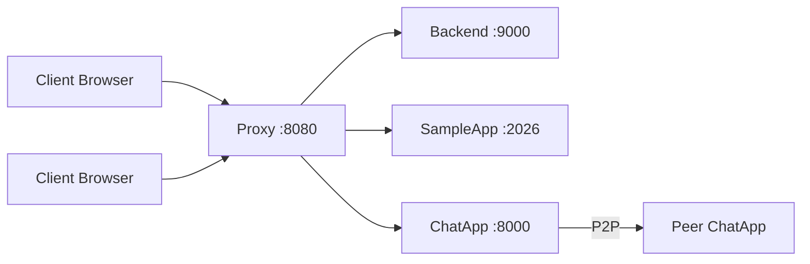

# Assignment 1 - Walkthrough & Elaboration

## What Was Built

A complete non-blocking HTTP server system with authentication and a hybrid chat application, built on the AsynapRous framework. The system combines **client-server** and **peer-to-peer** paradigms as required.

## Architecture Overview

*Please install Mermaid extension for VSCode to view the diagram.



**Three server processes:**
- **Proxy** (`start_proxy.py`) — Routes requests to backends based on hostname config
- **Backend** (`start_backend.py`) — Serves static files (HTML, CSS, images)
- **ChatApp** (`start_chatapp.py`) — Hybrid chat with 12 RESTful API routes

---

## Changes Made

### Phase 1: Bug Fixes (Foundation)

| File | Issue | Fix |
|------|-------|-----|
| [dictionary.py](file:///c:/Users/thinh/Documents/HK_6/Computer_Networks/btl/btl-mmt-asynaprous/daemon/dictionary.py) | `collections.MutableMapping` deprecated in Python 3.10+ | Changed to `collections.abc.MutableMapping` |
| [utils.py](file:///c:/Users/thinh/Documents/HK_6/Computer_Networks/btl/btl-mmt-asynaprous/daemon/utils.py) | `from urlparse` Python 2 syntax | Changed to `from urllib.parse` |
| [__init__.py](file:///c:/Users/thinh/Documents/HK_6/Computer_Networks/btl/btl-mmt-asynaprous/__init__.py) | Wrong import path `app.sampleapp` | Fixed to `apps.sampleapp` |
| [request.py](file:///c:/Users/thinh/Documents/HK_6/Computer_Networks/btl/btl-mmt-asynaprous/daemon/request.py) | Crash: `self.headers` accessed before assignment, typo `_raw_heaers` | Complete rewrite with proper initialization |

### Phase 2: Non-blocking Mechanisms (2 pts)

render_diffs(file:///c:/Users/thinh/Documents/HK_6/Computer_Networks/btl/btl-mmt-asynaprous/daemon/proxy.py)

render_diffs(file:///c:/Users/thinh/Documents/HK_6/Computer_Networks/btl/btl-mmt-asynaprous/daemon/backend.py)

**Key concept:** After `server.accept()` returns a client connection, instead of processing it sequentially (blocking), we spawn a **daemon thread** for each client. This allows the server to immediately go back to accepting new connections while the thread handles the request concurrently.

### Phase 3: HTTP Server Core

render_diffs(file:///c:/Users/thinh/Documents/HK_6/Computer_Networks/btl/btl-mmt-asynaprous/daemon/response.py)

render_diffs(file:///c:/Users/thinh/Documents/HK_6/Computer_Networks/btl/btl-mmt-asynaprous/daemon/httpadapter.py)

### Phase 4: Authentication (2 pts)

**New file:** [auth.py](file:///c:/Users/thinh/Documents/HK_6/Computer_Networks/btl/btl-mmt-asynaprous/daemon/auth.py) — Implements RFC 2617/7235/6265

**New file:** [db/users.json](file:///c:/Users/thinh/Documents/HK_6/Computer_Networks/btl/btl-mmt-asynaprous/db/users.json) — User credential store

### Phase 5: Chat Application (3 pts)

**New files:**
- [chatapp.py](file:///c:/Users/thinh/Documents/HK_6/Computer_Networks/btl/btl-mmt-asynaprous/apps/chatapp.py) — 12 RESTful routes for chat
- [start_chatapp.py](file:///c:/Users/thinh/Documents/HK_6/Computer_Networks/btl/btl-mmt-asynaprous/start_chatapp.py) — Launcher script
- [chat.html](file:///c:/Users/thinh/Documents/HK_6/Computer_Networks/btl/btl-mmt-asynaprous/www/chat.html) — Browser UI

---

## Testing Results

### API Tests (7/7 Passed ✅)

| Test | Endpoint | Result |
|------|----------|--------|
| Login | `POST /login/` | Session ID returned |
| Peer list | `POST /get-list/` | Active peers listed |
| Create channel | `POST /create-channel/` | Channel created |
| Broadcast | `POST /broadcast-peer/` | Message delivered |
| Messages | `POST /messages/` | Messages with timestamps |
| Direct message | `POST /send-peer/` | DM channel `dm:user1<->user2` created |
| Auth failure | `POST /login/` (wrong pw) | Error returned |

---

## Elaboration: What You Should Learn

### 1. Non-blocking Communication

**Blocking vs Non-blocking:** A blocking socket call (e.g., `recv()`) pauses the entire program until data arrives. In a server handling many clients, this means one slow client blocks everyone else.

**Solution — Multi-threading:** We used `threading.Thread(target=handle_client, ..., daemon=True).start()` after each `accept()`. The main thread continues accepting new connections while worker threads handle each client independently. The `daemon=True` flag ensures threads die when the main program exits.

```python
# In proxy.py and backend.py:
while True:
    conn, addr = server.accept()
    threading.Thread(target=handle_client, args=(...), daemon=True).start()
```

**Three mechanisms supported:**
- **Multi-thread** — Each client gets its own thread (simplest, used by default)
- **Callback/Event-driven** — Uses `selectors` to register callbacks triggered on I/O events
- **Coroutine (asyncio)** — Uses `async/await` with `StreamReader`/`StreamWriter` for cooperative multitasking

### 2. HTTP Protocol (Request/Response)

An HTTP request has this structure:
```
METHOD /path HTTP/1.1\r\n
Header-Name: Header-Value\r\n
\r\n
body
```

Our `Request.prepare()` parses this: extracts the method/path from the first line, splits headers from body at `\r\n\r\n`, and parses headers into a dictionary.

Our `Response.build_response()` constructs the reverse:
```
HTTP/1.1 200 OK\r\n
Content-Type: text/html\r\n
Content-Length: 1234\r\n
\r\n
<file content bytes>
```

### 3. Authentication (RFCs 2617, 7235, 6265)

**RFC 2617/7235 — HTTP Authentication:**
- Server sends `401 Unauthorized` + `WWW-Authenticate: Basic realm="..."` header
- Client sends `Authorization: Basic <base64(username:password)>` header
- Server decodes and verifies credentials

**RFC 6265 — Cookies:**
- After login, server sends `Set-Cookie: session_id=<UUID>` header
- Browser stores cookie and sends it with every subsequent request: `Cookie: session_id=<UUID>`
- Server validates the UUID against its in-memory session store

### 4. Client-Server Paradigm (Chat Tracker)

The chat server acts as a **centralized tracker**:
1. Peer A registers itself → `POST /submit-info/` with IP:port
2. Peer B queries for peers → `GET /get-list/`
3. Peer B now knows Peer A's address and can connect directly

This is exactly how BitTorrent trackers work.

### 5. Peer-to-Peer Paradigm (Direct Messaging)

After discovery, peers communicate **directly** without the server:
- `POST /connect-peer/` — Establish logical connection
- `POST /broadcast-peer/` — Send to all in a channel
- `POST /send-peer/` — Direct message to one peer
- `POST /receive-message/` — Incoming P2P endpoint

Each peer runs its own AsynapRous server, so it can both send and receive.

### 6. Proxy Server & Routing

The proxy intercepts all HTTP requests and routes them by hostname:
```
host "127.0.0.1:8080" → backend at 127.0.0.1:9000
host "chat.local"     → chatapp at 127.0.0.1:8000
```

It reads the `Host:` header from each request and forwards to the matching backend. This is how Nginx works in production.

### 7. RESTful API Design

Each chat operation maps to an HTTP method + path:
- **POST** for creating/sending (login, submit-info, send-peer)
- **GET** for reading (get-list, channels, messages)

Request/response bodies use JSON format, making the protocol easy to debug and extend.

## How to Run

```bash
# Terminal 1: Start the chat server
python start_chatapp.py --server-port 8000

# Terminal 2: (Optional) Start backend for static files
python start_backend.py --server-port 9000

# Terminal 3: (Optional) Start proxy
python start_proxy.py --server-port 8080

# Open browser
http://127.0.0.1:8000/chat.html
# Login: user1 / password1
```
